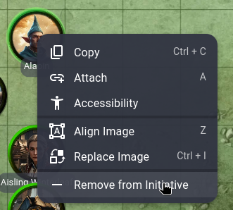

# Dragonbane Initiative Tracker

Dragonbane uses a set of cards from 1 - 10 to draw initiatve each round of combat. This extension allows you to add map tokens to the tracker and then draw their cards each round.

Clicking the name of a combatant in the tracker will also allow you to set their ferocity and provide a custom label. 

Clicking an individual card allows you to explicitly set its value, mark it as kept for subsequent rounds or mark the players turn as done.